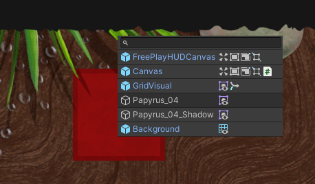
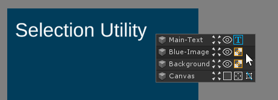

# Selection Utility

## Description
The Nementic Selection Utility is a small Unity tool which facilitates selecting GameObjects in the SceneView by displaying a context menu with all objects currently under the mouse cursor as a dropdown similar to how layers in common image editing software can be selected.

## Setup
This tool has no dependencies other than the Unity editor itself and becomes available as soon as it is installed. The currently verified Unity versions are 2018.4 - 2019.3.

## Usage
Right-click over GameObjects in the SceneView to show a dropdown of all objects that can be selected. The list is sorted by depth from front to back and displays icons for each component on a selectable GameObject. Left-click an item in the list to select it.

## Thanks
This tool was insprired by [Matias Mansilla (@MatiM36)](https://twitter.com/MatiM36/status/1132014379417964544) after he was featured on the [Unity Blog Community Component June 22, 2019](https://blogs.unity3d.com/2019/06/22/community-component-audio-design-pixel-games-custom-tools-and-best-of-made-with-unity-on-youtube/).
